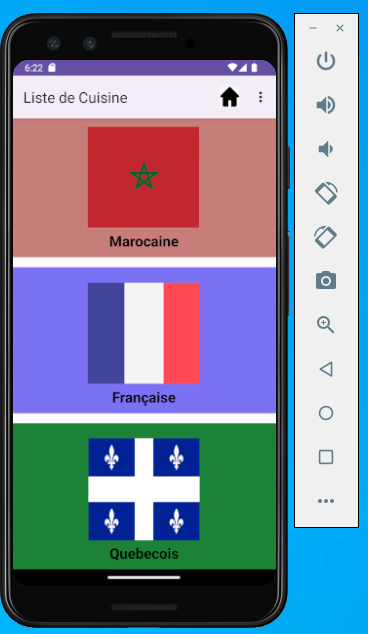
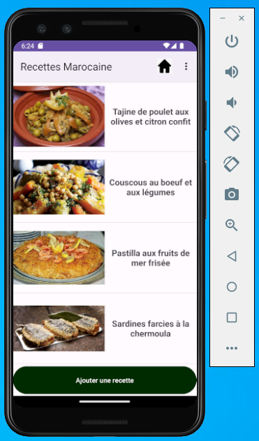
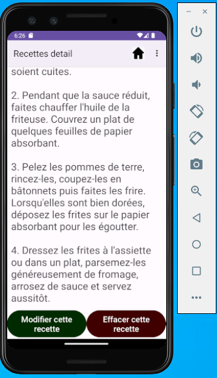

# LISTE DE RECETTES

Cette application a été créée dans le cadre du projet de fin de cours Android en utilisant des concepts d'algorithmique et de programmation en Java pour les appareils mobiles Android

# introduction

Cette application permet aux utilisateurs de sélectionner une catégorie spécifique de recettes par pays, comme la cuisine québécoise, française ou marocaine.

# Descriptions

Ces catégories seront stockées dans une base de données et récupéreront des données par un nom et une image.

On sélectionne par exemple la cuisine marocaine et on affiche la liste des recettes marocaines. De plus, on a la possibilité d'ajouter une recette.

On peut afficher le détail de la recette.

On peut modifier une image ou un texte.

Créer un formulaire pour contacter et choisir un cours. Ces données seront récupérées par la base de données.

